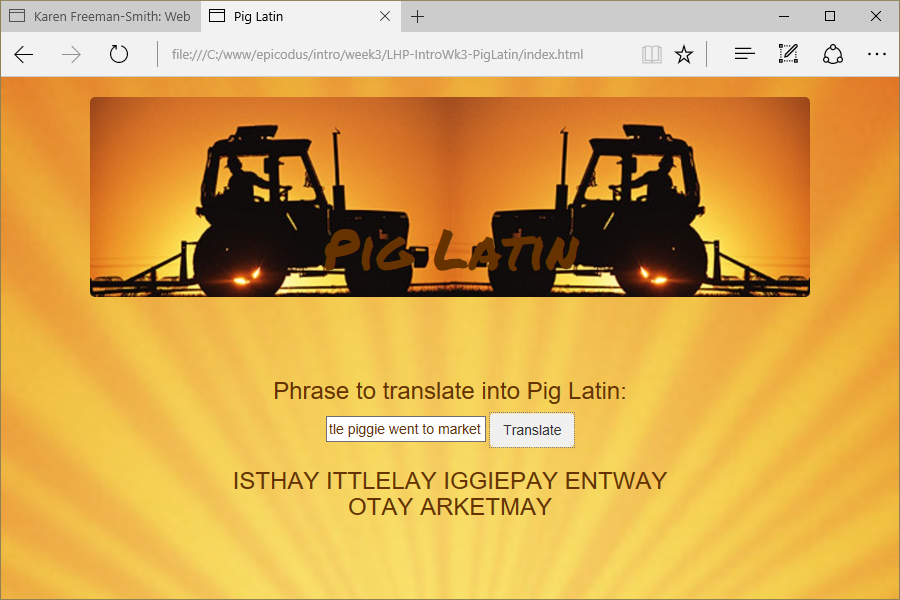

# Pig Latin Translator
Version 0.0.1: April 26, 2016
by [Karen Freeman-Smith](https://karenfreemansmith.github.io)

### Technologies Used
HTML, CSS, Bootstrap, JavaScript, jQuery

## Description
*[Learn How To Program](http://learnhowtoprogram.com) Intro to Programming Week 3 Individual Project: A webpage that translates your words into pig latin.*

## Setup/Installation
* [View on Github Pages](https://karenfreemansmith.github.io/LHP-IntroWk3-PigLatin)
* _OR_
* Clone directory
* Open index.html in your favorite browser

## Support & Contact
For questions, concerns, or suggestions please email karenfreemansmith@gmail.com

## Specifications
* Removes first letter of each word and adds it to the end, along with "ay".
(Passes test for "Hey World" | "eyHay orldWay")
* For words that start with a vowel, add "ay" to the end.
(Passes test for "oranges and apples" | orangesay anday applesay)
* Words that start with more than one consonant: move all consonants and add "ay". For words that start with "y", treat the "y" as a consonant.
(Passes test for "starry night" | "arrystay ightnay")
* Display results as upper case
  (Test: "Hey World" | "EYHAY ORLDWAY")

## Known Issues
Still needed:
  *  If the first consonants include "qu", move the "u" along with the "q".
    (Test: "even quiet pigs squeal" | "evenay itequay igspay ealsquay")
  * remove/replace punctuation as needed.
    (Test: "Hey, World!" | "Eyhay, orldway!")

## Legal
*Licensed under the GNU General Public License v3.0*

Copyright (c) 2016 Copyright _[Karen Freeman-Smith](https://karenfreemansmith.github.io)_ All Rights Reserved.
